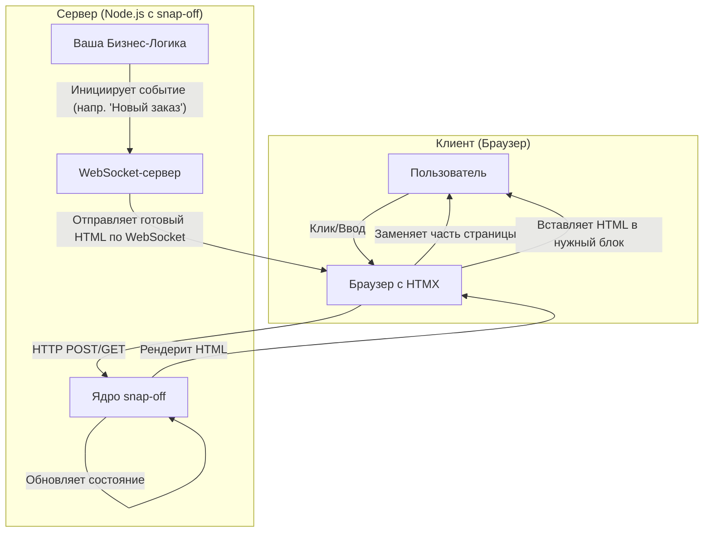

# snap-off v2.0 - "Гибридный Реактор"

**Слоган:** "Серверная мощь, локальная скорость, пуленепробиваемая архитектура."

`snap-off` — это гибридный серверный компонентный движок для Node.js, созданный для разработки молниеносных и отказоустойчивых интерфейсов в контролируемых средах (локальные сети, интранет, POS-системы, админ-панели, внутренние инструменты).

Он построен на философии **"правильный инструмент для каждой задачи"**, сочетая несокрушимую надежность HTTP с реактивностью WebSocket.

---

## 🚀 Философия: "Правильный инструмент для каждой задачи"

Современная веб-разработка часто навязывает догму "один подход для всего", что приводит к излишней сложности на клиенте (client-side state management, virtual DOM diffing, hydration). `snap-off` отвергает этот подход в пользу прагматичной гибридной модели.

*   **HTTP для действий пользователя (Request/Response):** Любое действие пользователя (клик, ввод данных) — это простой и предсказуемый HTMX-запрос. Состояние хранится и управляется **исключительно на сервере**. Это устраняет 99% ошибок, связанных с управлением состоянием на клиенте. Надежность — наш абсолютный приоритет.

*   **WebSocket для серверных событий (Push):** Когда серверу нужно немедленно обновить интерфейсы клиентов (например, "поступил новый заказ"), он отправляет легковесное HTML-сообщение по WebSocket. Клиент, получив его, просто вставляет готовый HTML в нужное место. Никакой логики на клиенте.

Эта гибридная модель дает нам лучшее из двух миров:



---

## 🔥 Ключевые особенности

*   **Нулевая клиентская логика:** Ваши компоненты — это простые `*.js` и `*.html` файлы на сервере. Никакого управления состоянием на клиенте.
*   **Изолированные стили "из коробки":** CSS-правила, описанные в `style.css` компонента, автоматически получают уникальные атрибуты для 100% стилистической изоляции.
*   **Реактивность в реальном времени:** Встроенный WebSocket-сервер позволяет "проталкивать" обновления на клиенты без лишних усилий.
*   **Простая и понятная структура компонентов:** Каждый компонент — это папка с четко определенными файлами, что обеспечивает порядок в проекте.
*   **Минималистичный API:** Всего несколько простых функций для рендеринга и обработки событий.

---

## 📦 Установка и быстрый старт

1.  **Установите зависимости:**
    ```bash
    npm install express express-session ws handlebars
    ```

2.  **Создайте структуру проекта:**
    ```
    /
    ├── public/
    │   ├── htmx.min.js
    │   └── ws.js
    ├── src/
    │   ├── components/
    │   │   └── counter/
    │   │       ├── component.json
    │   │       ├── handler.js
    │   │       ├── style.css
    │   │       └── view.html
    │   └── snap-off-core/
    │       └── ... (файлы ядра)
    └── server.js
    ```

3.  **Настройте ваш `server.js`:**

    ```javascript
    // server.js
    import express from 'express';
    import session from 'express-session';
    import http from 'http';
    import path from 'path';
    import { fileURLToPath } from 'url';
    import { createSnapOff, createSnapOffSocketServer } from './src/snap-off-core/index.js';

    // Конфигурация
    const __filename = fileURLToPath(import.meta.url);
    const __dirname = path.dirname(__filename);
    const app = express();
    const server = http.createServer(app);

    // Middleware
    app.use(express.static(path.join(__dirname, 'public')));
    app.use(express.json());
    app.use(session({ secret: 'your-secret', resave: false, saveUninitialized: true }));

    // Инициализация snap-off
    const snap = createSnapOff({ componentsPath: './src/components' });
    const snapSockets = createSnapOffSocketServer({ server });

    // Роуты
    app.post('/_snap/event/:instanceId/:eventName', snap.middleware);

    app.get('/', async (req, res) => {
        const counterHtml = await snap.render('counter', { initialValue: 0 }, req);
        res.send(`
            <!DOCTYPE html>
            <html>
                <head>
                    <title>snap-off</title>
                    <script src="/htmx.min.js"></script>
                    <script src="/ws.js"></script>
                </head>
                <body hx-ext="ws" ws-connect="/_snap/ws">
                    ${counterHtml}
                </body>
            </html>
        `);
    });
    
    // Пример бизнес-логики, инициирующей WebSocket-событие
    app.post('/some-action', (req, res) => {
        const newOrderHtml = `<div>Новый заказ!</div>`; // HTML можно рендерить с помощью snap.render
        snapSockets.broadcast({ html: newOrderHtml });
        res.send("OK");
    });

    // Запуск сервера
    server.listen(3000, () => console.log('Server running on http://localhost:3000'));
    ```

---

## 🧩 Анатомия компонента

Компонент в `snap-off` — это просто папка. Например, `src/components/counter/`.

*   **`component.json`**: Метаданные (имя, описание).
    ```json
    { "name": "Счетчик", "description": "Простой счетчик." }
    ```

*   **`handler.js`**: Серверная логика. Чистые функции.
    ```javascript
    // Определяет начальное состояние
    export function createState(props) {
      return { count: props.initialValue || 0 };
    }

    // Обрабатывает события
    export const events = {
      increment: (state) => ({ ...state, count: state.count + 1 }),
      decrement: (state) => ({ ...state, count: state.count - 1 }),
    };
    ```

*   **`view.html`**: HTML-шаблон (Handlebars).
    ```html
    <div class="counter-root" snap-c-id="{{meta.id}}">
      <p>Счет: {{state.count}}</p>
      <button hx-post="/_snap/event/{{meta.id}}/increment" hx-target="closest .counter-root" hx-swap="outerHTML">+</button>
    </div>
    {{{styleTag}}}
    ```

*   **`style.css`** (опционально): Изолированные стили.
    ```css
    .counter-root {
      border: 1px solid #ccc;
      padding: 1em;
    }
    ```

---

## 🛠️ API

### `createSnapOff(config)`
Инициализирует ядро.
*   `config.componentsPath`: Путь к папке с компонентами.
*   **Возвращает:** `{ render, middleware }`.

### `snap.render(componentName, props, req)`
Рендерит компонент в HTML.
*   `componentName` (string): Имя компонента.
*   `props` (object): Пропсы для `createState`.
*   `req` (object): Объект запроса Express для доступа к сессии.
*   **Возвращает:** `Promise<string>` с готовым HTML.

### `snap.middleware`
Express middleware для обработки событий от HTMX. Подключается к роуту `app.post('/_snap/event/:instanceId/:eventName', snap.middleware)`.

### `createSnapOffSocketServer({ server })`
Инициализирует WebSocket-сервер.
*   `server` (http.Server): Экземпляр HTTP-сервера.
*   **Возвращает:** `{ broadcast }`.

### `snapSockets.broadcast({ html })`
Отправляет HTML-сообщение всем подключенным клиентам.
*   `html` (string): Строка HTML для отправки.

---

## 🔬 Dev Lab

Для быстрой итеративной разработки используйте встроенную "Мастерскую".

```bash
node src/lab/lab-server.js
```
Откройте `http://localhost:4000`, чтобы увидеть галерею всех ваших компонентов и тестировать их в изоляции.

---

## 📜 Лицензия

[MIT](LICENSE)