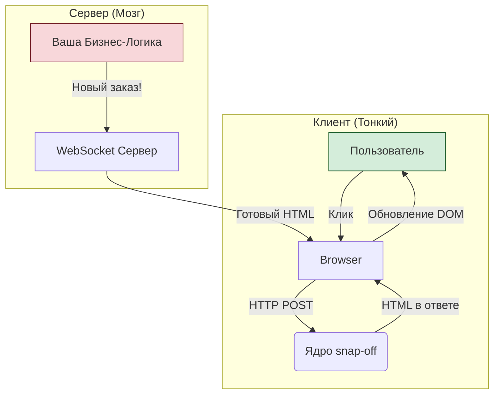

# Документация `snap-off`: 1. Философия и Архитектура

Добро пожаловать в документацию `snap-off`. Этот документ объясняет **почему** `snap-off` существует и **как** он устроен на концептуальном уровне. Понимание этой философии — ключ к эффективному использованию фреймворка.

## 1.1. Основная проблема: Сложность на клиенте

Современные веб-приложения, особенно в бизнес-сегменте (CRM, ERP, POS-системы, админ-панели), часто страдают от избыточной сложности на стороне клиента (браузера). Эта сложность проявляется в:

-   **Управлении состоянием (State Management):** Синхронизация данных между клиентом и сервером — источник бесчисленных ошибок.
-   **Сложных клиентских фреймворках:** React, Vue, Angular — мощные инструменты, но их использование в контролируемых средах (например, в локальной сети) часто является избыточным и вносит ненужные слои абстракции (Virtual DOM, гидратация, бандлинг).
-   **Хрупкости:** Чем больше логики на клиенте, тем больше вероятность ошибок, связанных с сетью, версиями браузера или действиями пользователя.

`snap-off` создан, чтобы решить эту проблему, вернув "центр тяжести" приложения обратно на сервер.

## 1.2. Философия: "Правильный инструмент для каждой задачи"

Мы не пытаемся изобрести универсальное решение. Вместо этого мы используем два проверенных временем протокола, каждый для своей специфической цели. Это и есть **Гибридный Реактор**.

### Модель 1: HTTP для Действий Пользователя (Надежность)

Любое осознанное действие пользователя — клик по кнопке, отправка формы, выбор элемента из списка — это предсказуемый, атомарный акт. Для таких действий нет ничего надежнее и проще, чем классический цикл HTTP Request/Response.

**Как это работает в `snap-off`:**
1.  Пользователь нажимает на кнопку.
2.  Библиотека HTMX на клиенте отправляет простой HTTP POST-запрос на специальный URL сервера, например, `/_snap/event/instance_id/event_name`.
3.  Сервер `snap-off` принимает запрос.
4.  Он находит состояние нужного компонента в сессии.
5.  Вызывает соответствующий обработчик события (`handler.js`), который изменяет это состояние.
6.  Сервер перерисовывает **только этот компонент** в новый HTML-фрагмент.
7.  Сервер отправляет этот HTML-фрагмент обратно в HTTP Response.
8.  HTMX получает HTML и бесшовно заменяет старую версию компонента на новую.

**Преимущества:**
-   **Несокрушимая надежность:** Состояние всегда на сервере. Даже если клиент потеряет соединение на полпути, ничего не сломается. При следующем действии он просто получит актуальное состояние.
-   **Простота:** Никакого управления состоянием на клиенте. JavaScript на клиенте почти не нужен.
-   **Безопасность:** Вся бизнес-логика остается на сервере, она не "утекает" в клиентский код.

### Модель 2: WebSocket для Серверных Событий (Реактивность)

Иногда серверу нужно инициировать обновление самостоятельно, без действия пользователя. Например, в POS-системе на кухне приготовили заказ, и нужно немедленно обновить экраны всех официантов.

Для этой задачи идеально подходит WebSocket, но мы используем его не для обмена сложными данными, а как **сигнальный кабель**.

**Как это работает в `snap-off`:**
1.  В вашей бизнес-логике происходит событие (например, `database.on('new_order', ...)`).
2.  Вы вызываете одну простую функцию: `snapSockets.broadcast({ html: '...' })`.
3.  Сервер `snap-off` берет предоставленный вами HTML-фрагмент и отправляет его по WebSocket-каналу **всем** подключенным клиентам.
4.  Клиентское расширение HTMX для WebSocket ловит это сообщение.
5.  Оно находит на странице специальный "приемник" (`
`) и вставляет полученный HTML внутрь него.

**Преимущества:**
-   **Мгновенные обновления:** Интерфейсы реагируют в реальном времени.
-   **Минимальная нагрузка:** Мы не гоняем JSON. Мы отправляем готовый к отображению HTML. Сервер решает, как должно выглядеть обновление, а не клиент.
-   **Сохранение простоты:** На клиенте по-прежнему нет сложной логики. Он просто вставляет то, что ему прислали.

## 1.3. Схематичная архитектура

Эта диаграмма иллюстрирует взаимодействие двух моделей.

Понимая эту гибридную архитектуру, вы сможете максимально эффективно использовать `snap-off` для создания быстрых, надежных и легко поддерживаемых веб-приложений.

---
**Следующий документ:** [2. Анатомия компонента](./02-component-anatomy.md)